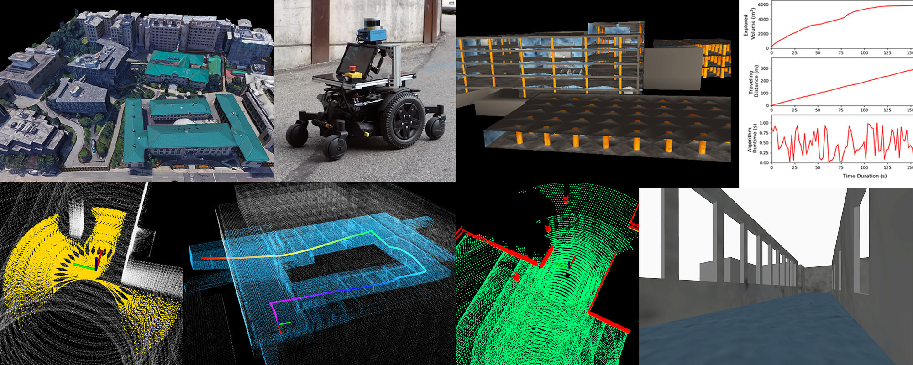

The repository is meant for leveraging system development and robot deployment for ground-based autonomous navigation and exploration. Containing a variety of simulation environments, autonomous navigation modules such as collision avoidance, terrain traversability analysis, waypoint following, etc, and a set of visualization tools, users can develop autonomous navigation systems and later on port those systems onto real robots for deployment.

Please use instructions on our [project page](https://www.cmu-exploration.com).

# 问题：U型弯

local planner规划中是加了避障功能，但当进入到U型场景中，会出不来，陷入死循环。

针对该问题，在local planner的基础上，完善规划功能，实现U型弯内自救。

主要添加的功能包为`polar_gap_planner`,实现效果：

[点击查看演示视频](img/U.mp4)
